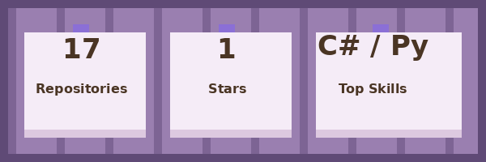
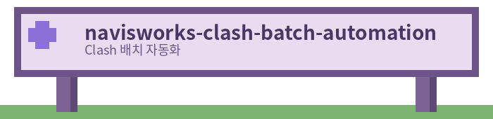

# 안녕하세요, limccw입니다 👋

**Plant BPI Engineer / 3D CAD Automation Developer**
Plant EPC 프로젝트의 3D CAD 시스템 운영·자동화와 데이터 엔지니어링을 담당하고 있습니다. (약 8년 경력)

---

## 🛠 주요 업무 영역

- **3D CAD Administration & Automation**: AVEVA E3D, Smart3D, Navisworks 관리 및 Add-in/자동화 도구 개발
- **IM Data Management**: Tag/Property Register QC, 대규모 플랜트 데이터 정합성 검증
- **IT Lead**: 서버 인프라 운영, IDC 마이그레이션, 라이선스 모니터링 시스템 구축
- **Data Engineering & AI/ML**: SQL/Python 기반 파이프라인, Palantir Foundry, Clash Prediction 모델링

---

## 💻 Tech Stack

**Languages & DB**

**Plant 3D CAD / BIM**

**Data & AI / ML**

**Infra & Automation**

---

## 📊 GitHub Stats

---

## 🚀 대표 프로젝트

### 🔹 AI 기반 Clash / QC 자동 예측
설계 데이터의 텍스트 속성을 ko-sroberta로 임베딩하고, LightGBM/XGBoost로 클래시(간섭) 결과를 분류하는 머신러닝 파이프라인. Tag/Property Register의 대규모 결측치·정합성 오류를 자동 검증하는 QC 시스템과 연동.

### 🔹 Navisworks Clash Batch Automation
Navisworks API를 활용해 클래시 테스트 실행을 배치화하고, NWD 게시 옵션·배포 보안 정책(End Date, 재저장 제한)을 자동 적용하는 애드인. 수작업으로 반복되던 클래시 검토 프로세스를 자동화.

### 🔹 Palantir Foundry 파이프라인 → SQL 전환
Python/ETL 기반으로 운영되던 Foundry 데이터 파이프라인을 SQL 기반 트랜스포메이션으로 전환. Pipeline Builder, Contour, Data Lineage를 활용한 데이터셋 정합성 검증 및 API 기반 배치 스케줄링 체계 구축.

### 🔹 License / Session Monitoring
EPC 계열(S3D, E3D, Navisworks 등) 툴의 유휴 세션을 감지해 자동 정리하는 경량 모니터링 유틸리티.

---

## 📫 Contact

- Location: Seoul, South Korea

---

*"현장의 문제를 자동화로 해결합니다."*
